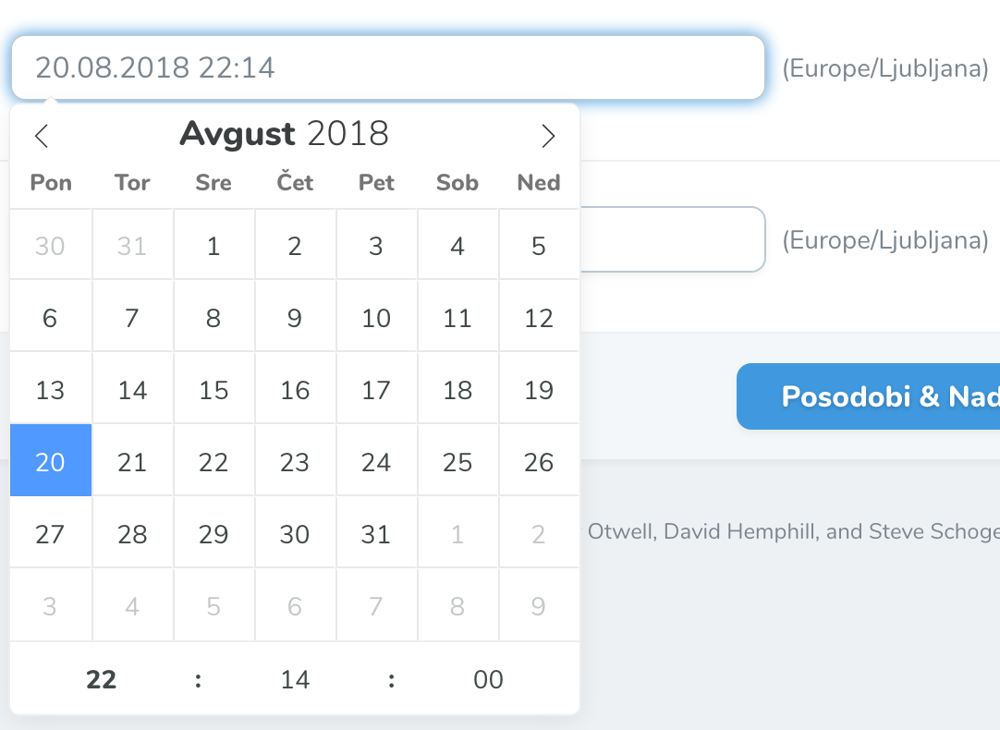

# Italian DateTime

##### Italian datepicker for Laravel Nova

Apply Italian localisation to Laravel Nova's default `DateTime` field that currently doesn't support localisation out of the box.



## Installation

You can install the package in to a Laravel app that uses [Nova](https://nova.laravel.com) via composer:

```bash
composer require zingazzi/italian-date-time
```

## Usage

The API is exactly the same as with [Nova's default `DateTime` Field](https://nova.laravel.com/docs/1.0/resources/fields.html#datetime-field)

Simply use `ItalianDateTime` class instead of `DateTime` directly or alias it like the example below so you won't have to refactor too much existing code.

```php
<?php

namespace App\Nova;

use Illuminate\Http\Request;
use Laravel\Nova\Fields\{ID, Password, Select, Text};
use Zingazzi\ItalianDateTime\ItalianDateTime as DateTime;

class User extends Resource
{
    /**
     * The model the resource corresponds to.
     *
     * @var string
     */
    public static $model = 'App\User';

    /**
     * The single value that should be used to represent the resource when being displayed.
     *
     * @var string
     */
    public static $title = 'name';

    /**
     * The columns that should be searched.
     *
     * @var array
     */
    public static $search = ['name',
                             'email'];

    /**
     * Get the fields displayed by the resource.
     *
     * @param  \Illuminate\Http\Request $request
     * @return array
     */
    public function fields(Request $request)
    {
        return [
            ID::make()->sortable(),

            Text::make(__('Name'), 'name')
                ->sortable()
                ->rules('required', 'max:255'),

            Text::make(__('Email Address'), 'email')
                ->sortable()
                ->rules('required', 'email', 'max:254')
                ->creationRules('unique:users,email')
                ->updateRules('unique:users,email,{{resourceId}}'),

            Password::make(__('Password'), 'password')
                    ->onlyOnForms()
                    ->creationRules('required', 'string', 'min:6')
                    ->updateRules('nullable', 'string', 'min:6'),

            DateTime::make(__('Created at'), 'created_at')
                    ->format('DD.MM.YYYY HH:mm:ss')
                    ->creationRules('required', 'date')
                    ->sortable(),

            DateTime::make(__('Updated at'), 'updated_at')
                    ->format('DD.MM.YYYY HH:mm:ss')
                    ->updateRules('required', 'date')
                    ->hideFromIndex(),
        ];
    }

    /**
     * Get the cards available for the request.
     *
     * @param  \Illuminate\Http\Request $request
     * @return array
     */
    public function cards(Request $request)
    {
        return [];
    }

    /**
     * Get the filters available for the resource.
     *
     * @param  \Illuminate\Http\Request $request
     * @return array
     */
    public function filters(Request $request)
    {
        return [];
    }

    /**
     * Get the lenses available for the resource.
     *
     * @param  \Illuminate\Http\Request $request
     * @return array
     */
    public function lenses(Request $request)
    {
        return [];
    }

    /**
     * Get the actions available for the resource.
     *
     * @param  \Illuminate\Http\Request $request
     * @return array
     */
    public function actions(Request $request)
    {
        return [];
    }
}

```